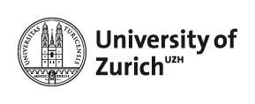

## Causality Workshop 2018 

We are looking forwart to our first **Causality Workshop 14th of December 2018.** 

The event will take place at <a href="https://www.plaene.uzh.ch/KO2">**University of Zürich, KO2-F-156**</a> (next to UZH main building and Mensa)  and is jointly organised by Beate Sick (Department of Biostatistics UZH) and Gilles Kratzer (Applied Statstics group UZH).

### Focus

The focus of the workshop is on sharing ideas and experience on how to approach intervention planning or causal research questions when working with observational data. We want discuss how to incorporate causal models in our projects. We do not assume familiarity with the theory of causal models but will give some [input talks](talks.md). We like to have **active participation** and encourage contributions (short talks), discussions, and all kind of questions.  

### Subscription
Everybody who is interested in causality is welcome to participate. Note that the number of participants is limited to 30 persons (first come first serve) and attendees with active presentation will be given preference.  The workshop is free (no fees) - we thank Reinhard Furrer, head of the Applied Statistics group at UZH, for sponsoring the event. 

To register, please put your  name and your e-mail on the list below:

  <a href="https://docs.google.com/spreadsheets/d/152oGwHph-zKIKvuVZOR4Ws36xfrmyrhaU6WT8BvJNNM/edit?usp=sharing">**participants_list**</a>

### Preliminary Program: 

Time &nbsp; &nbsp; &nbsp; &nbsp; &nbsp; &nbsp; &nbsp; &nbsp; &nbsp; &nbsp; &nbsp; | Presenter &nbsp; &nbsp; &nbsp; &nbsp; &nbsp;&nbsp; &nbsp; &nbsp; &nbsp; &nbsp; &nbsp; &nbsp; &nbsp; &nbsp; &nbsp; &nbsp;&nbsp; &nbsp; &nbsp; &nbsp; &nbsp; &nbsp; | Topic &nbsp; &nbsp; &nbsp; &nbsp; &nbsp; &nbsp; &nbsp; &nbsp; &nbsp; &nbsp; &nbsp;&nbsp; &nbsp; &nbsp; &nbsp; &nbsp; &nbsp; &nbsp; &nbsp; &nbsp; &nbsp; &nbsp;&nbsp; &nbsp; &nbsp; &nbsp; &nbsp; &nbsp; &nbsp; &nbsp; &nbsp; &nbsp; &nbsp; &nbsp; &nbsp; &nbsp; &nbsp; &nbsp; &nbsp; &nbsp; &nbsp; &nbsp; &nbsp; &nbsp; &nbsp; &nbsp;
---|---|---
09:00 - 09:10    | --        | Arriving
09:10 - 09:20    | Beate and Gilles | Welcome 
09:20 - 10:15    | Beate Sick (UZH) | [Talk](talks.md): The book of Why by Judea Pearl and Dana Mackenzie with hands on part
10:15 - 10:45    |  --  | Coffee Break
10:45 - 11:10    | Julia Casutt | [Talk](talks.md): Effects of client-counselor matching on counseling and motivating unemployed clients
11:10 - 12:00    | Gilles Kratzer (UZH) | [Talk](talks.md): Bayesian networks meet observational data 
12:00 - 13:30    | -- | Lunch at your own expense (e.g. Mensa UZH)
13:30 - 14:20    | Markus Kalisch (ETH) | [Talk](talks.md): Comparing covariate adjustment in interventional and observational studies
14:20 - 14:50     |  Daniela Buchwald (LMU) | [Talk](talks.md): Methods to estimate personalised treatment effects in observational data
14:50 - 15:10    |  --  | Coffee Break
15:10 - 15:35     | Heidi Seibold (LMU) | [Talk](talks.md): Challenges of intervention planning in an ongoing project with observational MS patient data
15:35 - 16:00     |  Christoph Molnar (LMU) | [Talk](talks.md): Interpretable Machine Learning
16:00 - 17:00    | all |  **Discussion round**, closing, **apero**

In case of any question please feel free to contact us (beate.sick@uzh.ch, gilles.kratzer@uzh.ch).
